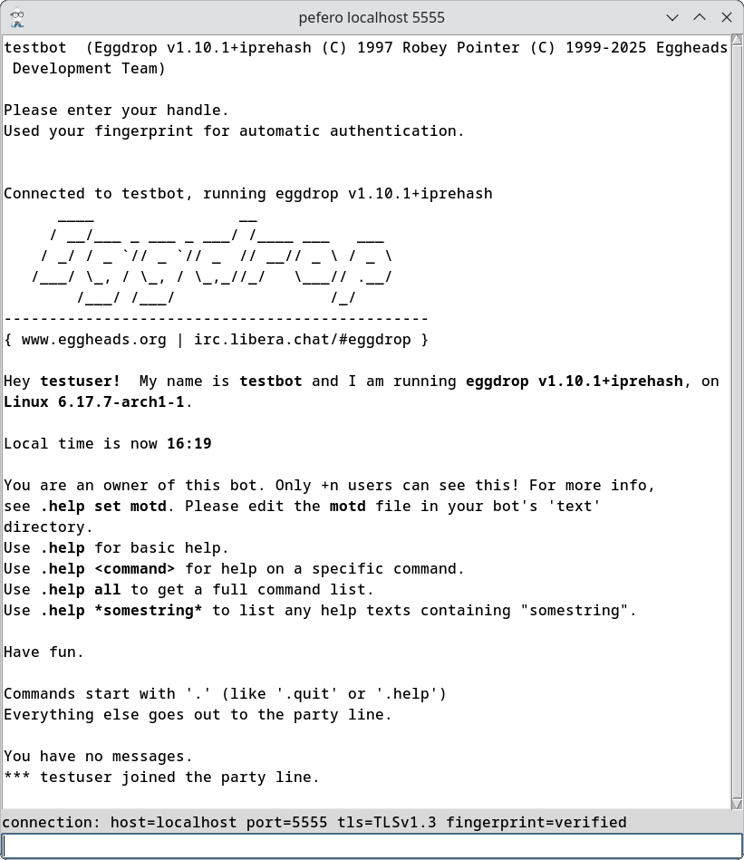

**Description**

  pefero is an [eggdrop](https://www.eggheads.org) telnet client written in Python and Tk featuring:

- IPv4 and IPv6 connection
- Plain and TLS connection
- History
- Eggdrop command autocompletion
- CertFP (tls certificate authentication)
- Certificate pinning (fingerprint verification)
- automatic login

**Usage**

```
Usage: ./pefero.py [OPTION]... HOST

  -p, --port=PORT        port
                         default 3333
                         prefix with + to enable TLS
  -c, --cert=FILE        use CertFP with TLS certificate FILE
  -k, --key=FILE         use CertFP with TLS key FILE
  -f, --fingerprint=HASH use certificate pinning
                         verify eggdrop cert fingerprint equals sha256 HASH
                         e.g.: DE:AD:BE:EF:DE:AD:BE:EF:DE:AD:BE:EF:DE:AD:BE:EF:DE:AD:BE:EF:DE:AD:BE:EF:DE:AD:BE:EF:DE:AD:BE:EF
                         see: openssl x509 -in eggdrop.crt -noout -fingerprint -sha256
  -l, --user=USER        attempt automatic login as USER
  -h, --help             display this help and exit
  -v, --version          output version information and exit
```

**Example**

```
./pefero.py -p +5555 -c testuser.crt -k testuser.key -f DE:AD:BE:EF:DE:AD:BE:EF:DE:AD:BE:EF:DE:AD:BE:EF:DE:AD:BE:EF:DE:AD:BE:EF:DE:AD:BE:EF:DE:AD:BE:EF -l testuser localhost
```



**License**

MIT License\
Copyright (c) 2025 Michael Ortmann

**Website**

https://codeberg.org/mortmann/pefero

**Links and Thanks to everyone involved there**

https://www.eggheads.org\
Mitja Martini, Russell Adams, RedFantom and https://github.com/TkinterEP/ttkwidgets for https://github.com/TkinterEP/ttkwidgets/blob/master/ttkwidgets/autocomplete/autocomplete_entry.py

Enjoy,\
Michael
